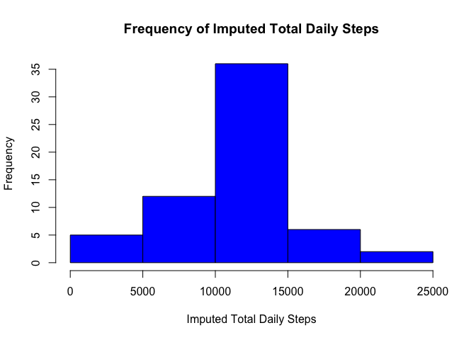

# Reproducible Research: Peer Assessment 1


### Loading and preprocessing the data

1. Load the activity data without any preprocessing at this time and display a summary view.


```r
activities <- read.csv('data/activity.csv')
summary(activities)
```

```
##      steps                date          interval     
##  Min.   :  0.00   2012-10-01:  288   Min.   :   0.0  
##  1st Qu.:  0.00   2012-10-02:  288   1st Qu.: 588.8  
##  Median :  0.00   2012-10-03:  288   Median :1177.5  
##  Mean   : 37.38   2012-10-04:  288   Mean   :1177.5  
##  3rd Qu.: 12.00   2012-10-05:  288   3rd Qu.:1766.2  
##  Max.   :806.00   2012-10-06:  288   Max.   :2355.0  
##  NA's   :2304     (Other)   :15840
```


### What is mean total number of steps taken per day?

1. Calculate the total number of steps taken per day.  

```r
## Remove NAs from the data
no.na.activities <- na.omit(activities)

## Sum the data by day
activitiesPerDay <- aggregate.data.frame(
    list(TotalDailySteps = no.na.activities$steps), 
    list(Date = no.na.activities$date), 
    sum)
activitiesPerDay
```

```
##          Date TotalDailySteps
## 1  2012-10-02             126
## 2  2012-10-03           11352
## 3  2012-10-04           12116
## 4  2012-10-05           13294
## 5  2012-10-06           15420
## 6  2012-10-07           11015
## 7  2012-10-09           12811
## 8  2012-10-10            9900
## 9  2012-10-11           10304
## 10 2012-10-12           17382
## 11 2012-10-13           12426
## 12 2012-10-14           15098
## 13 2012-10-15           10139
## 14 2012-10-16           15084
## 15 2012-10-17           13452
## 16 2012-10-18           10056
## 17 2012-10-19           11829
## 18 2012-10-20           10395
## 19 2012-10-21            8821
## 20 2012-10-22           13460
## 21 2012-10-23            8918
## 22 2012-10-24            8355
## 23 2012-10-25            2492
## 24 2012-10-26            6778
## 25 2012-10-27           10119
## 26 2012-10-28           11458
## 27 2012-10-29            5018
## 28 2012-10-30            9819
## 29 2012-10-31           15414
## 30 2012-11-02           10600
## 31 2012-11-03           10571
## 32 2012-11-05           10439
## 33 2012-11-06            8334
## 34 2012-11-07           12883
## 35 2012-11-08            3219
## 36 2012-11-11           12608
## 37 2012-11-12           10765
## 38 2012-11-13            7336
## 39 2012-11-15              41
## 40 2012-11-16            5441
## 41 2012-11-17           14339
## 42 2012-11-18           15110
## 43 2012-11-19            8841
## 44 2012-11-20            4472
## 45 2012-11-21           12787
## 46 2012-11-22           20427
## 47 2012-11-23           21194
## 48 2012-11-24           14478
## 49 2012-11-25           11834
## 50 2012-11-26           11162
## 51 2012-11-27           13646
## 52 2012-11-28           10183
## 53 2012-11-29            7047
```

2. Make a histogram of the total number of steps taken each day.  

```r
hist(activitiesPerDay$TotalDailySteps, 
     main="Frequency of Total Daily Steps",
     xlab="Total Daily Steps", col = "red")
```

 

3. Calculate and report the mean and median of the total number of steps taken per day.  

```r
## Calculate the Mean per day
meanActivitiesPerDay <- aggregate.data.frame(
    list(MeanDailySteps = no.na.activities$steps), 
    list(Date = no.na.activities$date), 
    mean)

## Calculate the Median per day
medianActivitiesPerDay <- aggregate.data.frame(
    list(MedianDailySteps = no.na.activities$steps), 
    list(Date = no.na.activities$date), 
    median)

## Merge the results into one table
meanAndMedian <- merge(meanActivitiesPerDay, medianActivitiesPerDay, by="Date")
meanAndMedian
```

```
##          Date MeanDailySteps MedianDailySteps
## 1  2012-10-02      0.4375000                0
## 2  2012-10-03     39.4166667                0
## 3  2012-10-04     42.0694444                0
## 4  2012-10-05     46.1597222                0
## 5  2012-10-06     53.5416667                0
## 6  2012-10-07     38.2465278                0
## 7  2012-10-09     44.4826389                0
## 8  2012-10-10     34.3750000                0
## 9  2012-10-11     35.7777778                0
## 10 2012-10-12     60.3541667                0
## 11 2012-10-13     43.1458333                0
## 12 2012-10-14     52.4236111                0
## 13 2012-10-15     35.2048611                0
## 14 2012-10-16     52.3750000                0
## 15 2012-10-17     46.7083333                0
## 16 2012-10-18     34.9166667                0
## 17 2012-10-19     41.0729167                0
## 18 2012-10-20     36.0937500                0
## 19 2012-10-21     30.6284722                0
## 20 2012-10-22     46.7361111                0
## 21 2012-10-23     30.9652778                0
## 22 2012-10-24     29.0104167                0
## 23 2012-10-25      8.6527778                0
## 24 2012-10-26     23.5347222                0
## 25 2012-10-27     35.1354167                0
## 26 2012-10-28     39.7847222                0
## 27 2012-10-29     17.4236111                0
## 28 2012-10-30     34.0937500                0
## 29 2012-10-31     53.5208333                0
## 30 2012-11-02     36.8055556                0
## 31 2012-11-03     36.7048611                0
## 32 2012-11-05     36.2465278                0
## 33 2012-11-06     28.9375000                0
## 34 2012-11-07     44.7326389                0
## 35 2012-11-08     11.1770833                0
## 36 2012-11-11     43.7777778                0
## 37 2012-11-12     37.3784722                0
## 38 2012-11-13     25.4722222                0
## 39 2012-11-15      0.1423611                0
## 40 2012-11-16     18.8923611                0
## 41 2012-11-17     49.7881944                0
## 42 2012-11-18     52.4652778                0
## 43 2012-11-19     30.6979167                0
## 44 2012-11-20     15.5277778                0
## 45 2012-11-21     44.3993056                0
## 46 2012-11-22     70.9270833                0
## 47 2012-11-23     73.5902778                0
## 48 2012-11-24     50.2708333                0
## 49 2012-11-25     41.0902778                0
## 50 2012-11-26     38.7569444                0
## 51 2012-11-27     47.3819444                0
## 52 2012-11-28     35.3576389                0
## 53 2012-11-29     24.4687500                0
```


### What is the average daily activity pattern?

1. Make a time series plot (i.e. `type = "l"`) of the 5-minute interval (x-axis) and the average number of steps taken, averaged across all days (y-axis).  


```r
library(ggplot2)

## Compute the average number of steps per 5 minute interval
intervalSteps <- aggregate.data.frame(
    list(AverageSteps = no.na.activities$steps), 
    list(Interval = no.na.activities$interval), 
    mean)

## Plot the averages
g <- ggplot(intervalSteps, aes(x = Interval, y = AverageSteps))
g + geom_line() + ylab("Average Steps Per Interval")
```

 

2. Which 5-minute interval, on average across all the days in the dataset, contains the maximum number of steps?  


```r
## Compute the 5 minute interval that contains the maximum average steps
intervalSteps[
    intervalSteps$AverageSteps == 
        max(intervalSteps$AverageSteps),]$Interval
```

```
## [1] 835
```

### Imputing missing values

1. Calculate and report the total number of missing values in the dataset (i.e. the total number of rows with `NA`s).  


```r
## The total number of rows minus the total number of rows without NAs
nrow(activities) - sum(complete.cases(activities))
```

```
## [1] 2304
```

2. Devise a strategy for filling in all of the missing values in the dataset. The strategy does not need to be sophisticated. For example, you could use the mean/median for that day, or the mean for that 5-minute interval, etc.  


```r
## I will use the mean for an interval to impute any missing activity steps.
##... See code in step 3.
```

3. Create a new dataset that is equal to the original dataset but with the missing data filled in.  


```r
## Copy activities to imputedActivites
imputedActivities <- activities

## for each activity...
for(n in 1:nrow(imputedActivities))
    {
    ## If the current step is NA
    if (is.na(imputedActivities[n,]$steps))
        {
        ## Set the steps to mean steps for that interval
        ##... using our previously calculated intervalSteps
        imputedActivities[n,]$steps = 
            intervalSteps[intervalSteps$Interval == 
                              imputedActivities[n,]$interval,]$AverageSteps
        }
    }

## Display the summary to show there are no missing values
summary(imputedActivities)
```

```
##      steps                date          interval     
##  Min.   :  0.00   2012-10-01:  288   Min.   :   0.0  
##  1st Qu.:  0.00   2012-10-02:  288   1st Qu.: 588.8  
##  Median :  0.00   2012-10-03:  288   Median :1177.5  
##  Mean   : 37.38   2012-10-04:  288   Mean   :1177.5  
##  3rd Qu.: 27.00   2012-10-05:  288   3rd Qu.:1766.2  
##  Max.   :806.00   2012-10-06:  288   Max.   :2355.0  
##                   (Other)   :15840
```

4.  Make a histogram of the total number of steps taken each day and Calculate and report the mean and median total number of steps taken per day. Do these values differ from the estimates from the first part of the assignment? What is the impact of imputing missing data on the estimates of the total daily number of steps?  


```r
## Sum the imputed data by day
imputedDaily <- aggregate.data.frame(
    list(TotalDailySteps = imputedActivities$steps), 
    list(Date = imputedActivities$date), 
    sum)

## Display a histogram of the imputed data
hist(imputedDaily$TotalDailySteps, 
     main="Frequency of Imputed Total Daily Steps",
     xlab="Imputed Total Daily Steps", col = "blue")
```

 

While there are more total steps for the imputed values the distribution of the imputed values is the same as the non-imputed.


```r
## Calculate the Mean per day for imputed values
meanImputedPerDay <- aggregate.data.frame(
    list(ImputedMeanDailySteps = imputedActivities$steps), 
    list(Date = imputedActivities$date), 
    mean)

## Calculate the Median per day for imputed values
medianImputedPerDay <- aggregate.data.frame(
    list(ImputedMedianDailySteps = imputedActivities$steps), 
    list(Date = imputedActivities$date), 
    median)

## Merge the results into one table
imputedMeanAndMedian <- merge(meanImputedPerDay, medianImputedPerDay, by="Date")
imputedMeanAndMedian
```

```
##          Date ImputedMeanDailySteps ImputedMedianDailySteps
## 1  2012-10-01            37.3825996                34.11321
## 2  2012-10-02             0.4375000                 0.00000
## 3  2012-10-03            39.4166667                 0.00000
## 4  2012-10-04            42.0694444                 0.00000
## 5  2012-10-05            46.1597222                 0.00000
## 6  2012-10-06            53.5416667                 0.00000
## 7  2012-10-07            38.2465278                 0.00000
## 8  2012-10-08            37.3825996                34.11321
## 9  2012-10-09            44.4826389                 0.00000
## 10 2012-10-10            34.3750000                 0.00000
## 11 2012-10-11            35.7777778                 0.00000
## 12 2012-10-12            60.3541667                 0.00000
## 13 2012-10-13            43.1458333                 0.00000
## 14 2012-10-14            52.4236111                 0.00000
## 15 2012-10-15            35.2048611                 0.00000
## 16 2012-10-16            52.3750000                 0.00000
## 17 2012-10-17            46.7083333                 0.00000
## 18 2012-10-18            34.9166667                 0.00000
## 19 2012-10-19            41.0729167                 0.00000
## 20 2012-10-20            36.0937500                 0.00000
## 21 2012-10-21            30.6284722                 0.00000
## 22 2012-10-22            46.7361111                 0.00000
## 23 2012-10-23            30.9652778                 0.00000
## 24 2012-10-24            29.0104167                 0.00000
## 25 2012-10-25             8.6527778                 0.00000
## 26 2012-10-26            23.5347222                 0.00000
## 27 2012-10-27            35.1354167                 0.00000
## 28 2012-10-28            39.7847222                 0.00000
## 29 2012-10-29            17.4236111                 0.00000
## 30 2012-10-30            34.0937500                 0.00000
## 31 2012-10-31            53.5208333                 0.00000
## 32 2012-11-01            37.3825996                34.11321
## 33 2012-11-02            36.8055556                 0.00000
## 34 2012-11-03            36.7048611                 0.00000
## 35 2012-11-04            37.3825996                34.11321
## 36 2012-11-05            36.2465278                 0.00000
## 37 2012-11-06            28.9375000                 0.00000
## 38 2012-11-07            44.7326389                 0.00000
## 39 2012-11-08            11.1770833                 0.00000
## 40 2012-11-09            37.3825996                34.11321
## 41 2012-11-10            37.3825996                34.11321
## 42 2012-11-11            43.7777778                 0.00000
## 43 2012-11-12            37.3784722                 0.00000
## 44 2012-11-13            25.4722222                 0.00000
## 45 2012-11-14            37.3825996                34.11321
## 46 2012-11-15             0.1423611                 0.00000
## 47 2012-11-16            18.8923611                 0.00000
## 48 2012-11-17            49.7881944                 0.00000
## 49 2012-11-18            52.4652778                 0.00000
## 50 2012-11-19            30.6979167                 0.00000
## 51 2012-11-20            15.5277778                 0.00000
## 52 2012-11-21            44.3993056                 0.00000
## 53 2012-11-22            70.9270833                 0.00000
## 54 2012-11-23            73.5902778                 0.00000
## 55 2012-11-24            50.2708333                 0.00000
## 56 2012-11-25            41.0902778                 0.00000
## 57 2012-11-26            38.7569444                 0.00000
## 58 2012-11-27            47.3819444                 0.00000
## 59 2012-11-28            35.3576389                 0.00000
## 60 2012-11-29            24.4687500                 0.00000
## 61 2012-11-30            37.3825996                34.11321
```

The imputed means and medians are exactly the same as before except now we have data for days where all values were previously NA.  The data is smoothed out by providing data for day that had no data.  After reviewing the data a better attempt at imputing the data may be to substitute the mean for the same interval for the same day of the week.


### Are there differences in activity patterns between weekdays and weekends?

1. Create a new factor variable in the dataset with two levels – “weekday” and “weekend” indicating whether a given date is a weekday or weekend day.  


```r
## Add a new column named dayLevel with the days of the week
no.na.activities$dayLevel <- 
    weekdays(as.Date(no.na.activities$date), abbreviate = TRUE)

## Update the day of the week as a "Weekend" or "Weekday"
no.na.activities$dayLevel <- 
    ifelse(grepl("Sat|Sun", no.na.activities$dayLevel), "Weekend", "Weekday")

## Make dayLevel a factor variable
no.na.activities$dayLevel <- as.factor(no.na.activities$dayLevel)

## Display the structure to see the new factor
str(no.na.activities)
```

```
## 'data.frame':	15264 obs. of  4 variables:
##  $ steps   : int  0 0 0 0 0 0 0 0 0 0 ...
##  $ date    : Factor w/ 61 levels "2012-10-01","2012-10-02",..: 2 2 2 2 2 2 2 2 2 2 ...
##  $ interval: int  0 5 10 15 20 25 30 35 40 45 ...
##  $ dayLevel: Factor w/ 2 levels "Weekday","Weekend": 1 1 1 1 1 1 1 1 1 1 ...
##  - attr(*, "na.action")=Class 'omit'  Named int [1:2304] 1 2 3 4 5 6 7 8 9 10 ...
##   .. ..- attr(*, "names")= chr [1:2304] "1" "2" "3" "4" ...
```


2. Make a panel plot containing a time series plot (i.e. `type = "l"`) of the 5-minute interval (x-axis) and the average number of steps taken, averaged across all weekday days or weekend days (y-axis). See the README file in the GitHub repository to see an example of what this plot should look like using simulated data.  


```r
library(lattice)

## Aggregate the average steps by Interval and DayLevel (Weekend or Weekday)
dayLevelIntervals <- aggregate.data.frame(
    list(AverageSteps = no.na.activities$steps), 
    list(Interval = no.na.activities$interval, DayLevel = no.na.activities$dayLevel), 
    mean)

## Display a panel plot by DayLevel
xyplot(AverageSteps ~ Interval | DayLevel, 
       data = dayLevelIntervals, type = "l", layout=c(1,2),
       ylab = "Average Steps per Interval")
```

 
